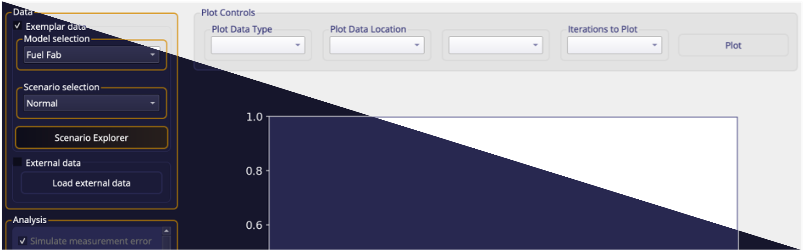
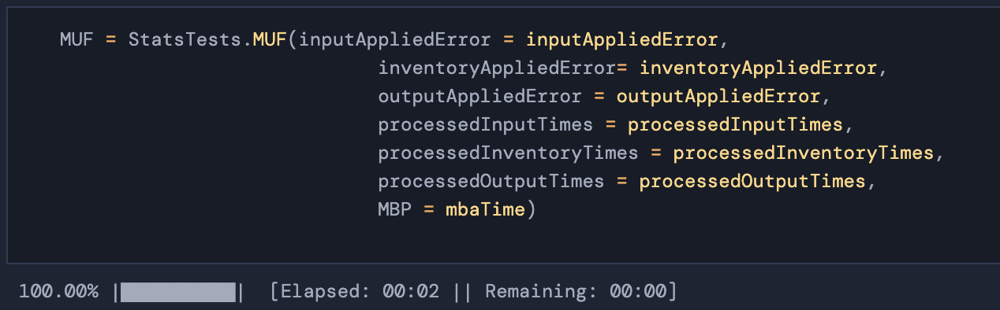

  

  
  
  

--- 

MAPIT (Material Performance Indicator Toolkit) is a Python package designed to aid in safeguards analysis of bulk materials. The inherent flexibility is designed to allow safeguards practitioners ask the "what if?" questions while providing transparency into commonly employed statistical tests. 

MAPIT provides both a graphical user interface (GUI) and an application program interface (API). The API can be used with other popular Python libraries to extend functionality and integrate with other analytical workflows. 

* [Features](#features)
* [Development](#devlopment)
* [Installation](#installation)
* [Getting Started](#getting-started)
* [Documentation](#documentation)
* [Contact](#contact)
* [Data Privacy](#data-privacy)
* [License](#license)

## Features

  
  

 

* Flexible I/O tools to allow analysis on a wide range of datasets
  * Permits analysis for datasets collected with non-uniform sample times
  * .csv or .mat file types

* Approachable graphical interface
  * Accessibility features for improved readability
  * Light/dark themes

* Tutorial dataset generated from a Separations and Safeguards Performance Model ([1](https://www.osti.gov/biblio/1375573-integration-sspm-stage-mpact-virtual-facility-distributed-test-bed),[2](https://www.osti.gov/biblio/1646073-separations-safeguards-performance-model-sspm-capabilities-application-integration),[3](https://www.osti.gov/biblio/1476138-bulk-handling-facility-modeling-simulation-safeguards-analysis)) fuel fabrication model based on IAEA STR-150 ([4](https://inis.iaea.org/search/search.aspx?orig_q=RN:17037216))

* Automated error propagation

* Automated calculation of common safeguards statistical tests
  * Material Unaccounted For (MUF) / Inventory Difference (ID)
  * Standard Error of MUF (sigma MUF) / Standard Error of ID (SEID)
  * Cumulative MUF (CUMUF)
  * Standardized Independent Transformed MUF (SITMUF)
  * Page's Trend Test on SITMUF

* Built in threshold optimization tools
* Visualization tools
* Data export capabilities
* Standalone Python-based API

## Devlopment

> :construction: **MAPIT IS IN BETA** :construction: \
> \
> You may notice various bugs and errors. Help contribute to this project by reporting them through our issue page.

We aim for biannual release updates for MAPIT, but if you have immediate needs that need to be addressed, please open an issue or contact us directly. 

## Installation

MAPIT does not yet have a PyPI or Conda repository, so it must be installed manually. Download the source code from here and install the requirements via either the `requirements.txt` or `requirements.yml`. Once the requirements are installed, use the GUI by launching `MAPIT_main.py` or access the API by ensuring proper pathing.

To streamline this process, we have included both Windows-based and Unix-based installers for those new to Python. These can be found in the `windows_scripts` and `unix_scripts` folder respectively. 

## Getting Started

After installation, the MAPIT GUI can be launched using `MAPIT_main.py` and examples of the API can be found in the `API_examples.ipynb` notebook. We have included an exemplar dataset and several tutorial exercises to help you get started, which can be found [here](https://sandialabs.github.io/MAPIT/guided_exercises.html)

## Documentation

We have included documentation for several guided exercises as well as the API, both can be found [here](https://sandialabs.github.io/MAPIT/)

## Contact

* Nathan Shoman, Sandia National Laboratories, nshoman@sandia.gov
* Pat Moosir, Sandia National Laboratories, mhiggin@sandia.gov

## Data Privacy

MAPIT is an entirely offline tool; we do not collect any data from MAPIT unless expressly provided by end users through contact with us. 

## License

* [License](LICENSE)
* [Third-Party Notice](NOTICE.md)

Sandia National Laboratories is a multimission laboratory managed and operated by National Technology and Engineering Solutions of Sandia, LLC, a wholly owned subsidiary of Honeywell International, Inc., for the U.S. Department of Energy's National Nuclear Security Administration under contract DE-NA-0003525.
