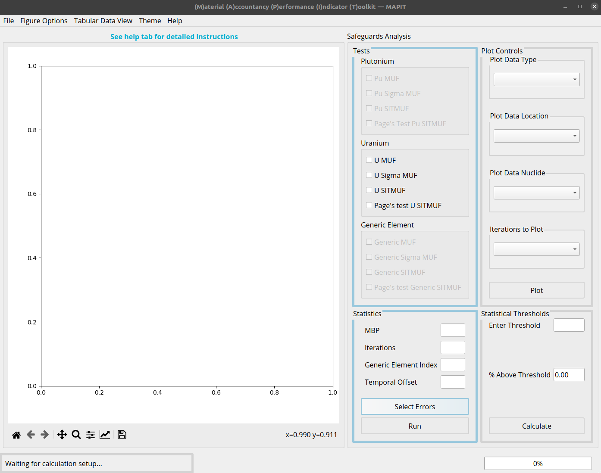
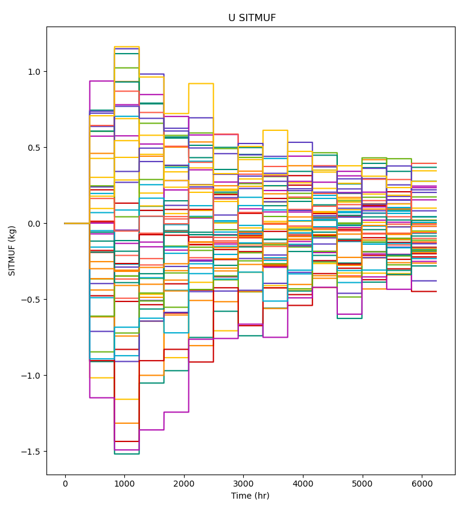
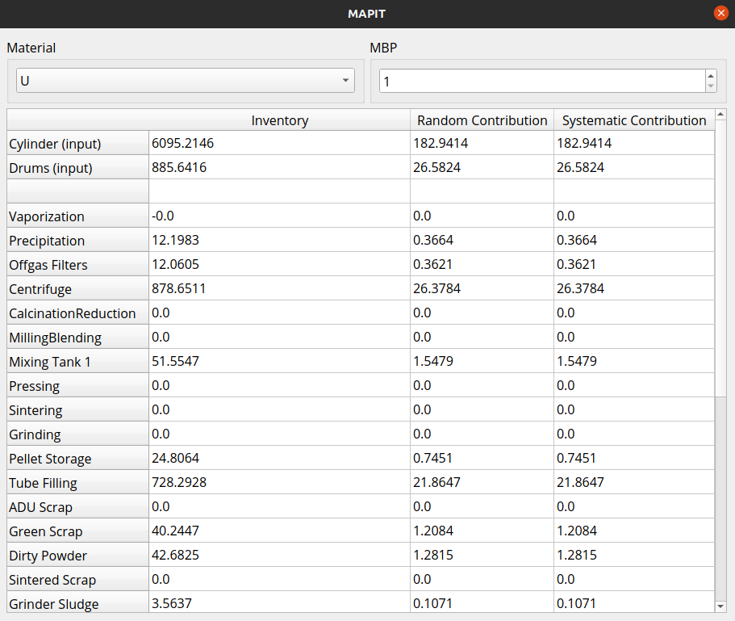

# Exercise 2: Impacts of measurement error

 

## Goal: Explore the impact of measurement error on safeguards metrics.

 

> :information_source: Recall that measurement error negatively impacts the ability to detect anomalies such as material loss.

> :exclamation: This exercise assumes that you are familiar with MAPIT and can perform tasks discussed in the previous [exercise](exercise1.md) (i.e. launching MAPIT, loading the included scenarios, setting up MAPIT to perform analyses, etc).

---

## Problem setup

---

1. Start this exercise by launching MAPIT, selecting the `SNL curated dataset` option, and loading the `Normal` dataset.
  * This tutorial starts by assuming you are at the main MAPIT interface (similar to the image below)

{:start="2"}
2. Select all the options in the Tests/Uranium box
  * There should be four in total

3. Next, configure the required parameters in the statistical box using the same parameters from exercise 1:
  * `MBP = 416`
  * `Iterations = 50`
        * :exclamation: If running on a lower performance device, try running with `Interations = 20`
  * `Generic Element Index = empty`
  * `Temporal Offset = empty`

4. Set the measurement errors by pressing the `Select Errors` button. Choose **3%** for **all random and systematic errors**.  

5. Run MAPIT by pressing the `Run` button.

---

## Data exploration

---

{:start="6"}
6. After running, several plot options should be available under the plot controls option (similar to image below).

> :pushpin: **Note** :pushpin: MAPIT can export any figures for later use. Simply click the floppy disc icon at the bottom of the plot.

{:start="7"}
7. Start by observing the calculated MUF values
  * Plotting options dynamically change based on the data type selected and number of iterations considered
  * Since `Iterations` were set to `<= 50` (a relatively small number), start by plotting them all.
  * The plot should *generally* look like the image below, but will vary due to the inherent randomness of the calculation.

  

  
  

{:start="8"}
8. Next, plot the U SEID (i.e. sigma MUF) and notice that it tends to remain around 95 kg.
  * The first balance period has a smaller SEID due to startup conditions

9. Try plotting the U SITMUF data.
  * Your plot should look similar to the one below
  * Notice that U SITMUF tends to decrease overtime and then reaches a steady state value
  * Also, SITMUF has (approximately) a mean of zero and standard deviation of one

  

  
  

> The results seen when plotting SITMUF match the description from earlier lessons. That is, that SITMUF is the independent MUF sequence. However, notice that the SITMUF values start larger than their final, steady state values.

> Recall that the transformation from MUF to SITMUF uses an estimate of the covariance matrix (shown below).

> The covariance matrix grows as repeated material balance calculations are made and observed, which results in a better approximation of the true covariance matrix. In fact, the approximation will converge on the true value as the number of measurements approaches infinity. **Consequently, the variance and mean of the transformed sequence, SITMUF, converge to 1 and 0 respectively as the covariance estimate improves.**

{:start="10"}

10. Finally, try plotting the Page U SITMUF. This is Page's trend test on SITMUF which is used to detect subtle trends in SITMUF that could indicate a material loss.
  * Page's test will be discussed further in the next exercise.
  * Feel free to try entering numbers into the `Enter Threshold` box and pressing `Calculate`. MAPIT will return the number of runs that exceed the user specified threshold, which is useful for analyzing performance of a safeguards system.
        * MAPIT returns the % of *all* runs over the threshold, even if not all are plotted. For example, even if only one of the 50 runs are plotted, it will still return the same value.

---

## Understanding error contribution

---

{:start="11"}
11. After examining the different quantities calculated by MAPIT, open the error contribution table to better understand the contributions of different KMPs to the material balance uncertainty. Do this by selecting the `Tabular Data View` drop down at the top of the main MAPIT window and selecting `Error Contribution`.

12. The error contribution table should display all the locations in addition to their random and systematic contributions to SEID. Your table should look similar to the image below.
  * The `inventory` column refers to the actual mass at the selected material balance period
        * For flows (e.g. inputs and outputs) this is the time integrated flow over the period
        * For inventories this is the instantneous inventory value
  * The random and systematic contribution are the contributions to SEID

> :pushpin: **Note** :pushpin: that only a single material is listed for this exercise (uranium) as other species are not tracked. However, if using imported datasets, there could potentially be other material options.

{:start="13"}
13. Try looking at different material balance periods.
  * The `Cylinder (input)` and `Fuel Pins (output)` have the largest inventory terms and consequently the largest contribution

14. Try running MAPIT again, this time try changing the `Cylinder (input)` and `Fuel Pins (output)` error terms to 1%.
  * MAPIT does not need to be restarted to perform another calculation on a new dataset, however, note that current results will be lost
  * Press the `Select Errors` button and edit the corresponding boxes to reduce the error for the two components.
  * Press `Run` to again calculate the statistical quantities.

15. Check the newly calculated values by plotting key quantities such as SEID.
  * Note that SEID has decreased dramatically from approximately 560 to 210.
  * Examine the `Error Contribution` and note that the contribution from the `Cylinder (input)` and `Fuel Pins (output)` has similarly fallen in magnitude.
  * The next exercise will consider the impact of measurement error for safeguards more concretely by considering a hypothetical material loss.

> :information_source: The material balance period can similarly impact key quantities like SEID. Longer balances lead to higher SEIDs whereas shorter balances lead to smaller SEIDs. However, there is a limitation to the gains of shorter material balances. While not explored in this exercise, further details can be found in [this work by Avenhaus and Jaech](https://resources.inmm.org/jnmm/subdividing-material-balances-time-andor-space).

---

> :tada: Congrats :tada:

---

## Summary

In this exercise, you learned about how to change simulated measurement errors in MAPIT and their impact on calculated statistical quantities. Further, the capability of MAPIT to show individual error components was also introduced.

* Higher measurement error leads to larger SEID values
* Uncertainty contributions rely on both measurement error and inventory size

> You have finished the second MAPIT exercise. Continue to [exercise 3](exercise3.md).
