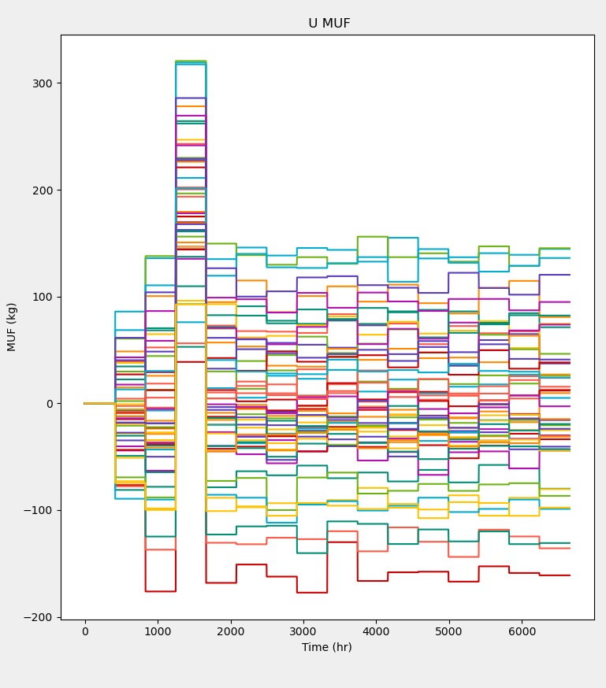

# Exercise 3: Material Loss

 

#### Goal: Gain familiarity with the notional material losses.

> :information_source: This exercise will prepare you for using MAPIT to evaluate safeguards systems.

> :exclamation: This exercise assumes that you are familiar with MAPIT and can perform tasks discussed in the previous exercises; [exercise 1](../docs/exercise1.md) and [exercise 2](../docs/exercise2.md).

---
## Problem setup
---

1. Start this exercise by launching MAPIT, selecting the `SNL curated dataset` option, and loading the `Abrupt` dataset.
  * This tutorial starts by assuming you are at the main MAPIT interface

2. Select all the options in the Tests/Uranium box
  * There should be four in total

3. Next, configure the required parameters in the statistical box using the same parameters from exercise 1 and 2:
  * `MBP = 416`
  * `Iterations = 50`
  * `Generic Element Index = empty`
  * `Temporal Offset = empty`

4. Set the measurement errors by pressing the `Select Errors` button. Choose **3%** for **all random and systematic errors**.  

5. Run MAPIT by pressing the `Run` button.

---
## Baseline data exploration
---

6. Start by plotting the various statistical quantities (i.e. MUF, SEID, SITMUF, and Page's trend test)
  * Note that the results look similar to the `Normal` dataset.
  * MUF plot should look similar to the image below.

 

7. Continue by examining the fuel pins. Do so by selecting `Ground Truth Data` for the data type and `Fuel Pins (output)` for the location.
  * Here, `Ground Truth Data` refers to the true value of the fuel pins (output), which can never be observed in practice.
  * :exclamation: **Note** : There are many fuel pins that are generated at a fuel fabrication facility. Plotting `Fuel Pins (output)` could take several seconds depending on your hardware.
  * Your plot should look similar to the image below.

 

8. Notice that starting around 1010 hours material is removed for about the next 100 hours. However, the statistical quantities did not reflect this material loss.

---
## Explore impact of lower uncertainty
---

9. Perform the calculations again using a value of **0.5%** for **all random and systematic errors**.
  * MAPIT does not need to be restarted. Simply press `Select Errors` and use the dropdown menus to select the new error values. Then press `Run`.

10. After MAPIT has run with the updated error values, try plotting the statistical quantities again. You should notice some observable changes have occurred.
  * MUF shows a distinct change during the material balance period in which the material loss occurs (see image below).
  * SEID, SITMUF, and Page's trend test on SITMUF should all exhibit changes due to the presence of the material loss.

 

> :information_source: This example demonstrates the importance of precise measurement systems. This particular loss was too small to be reliably detected at the 3% uncertainty level.  

---

> :tada: Congrats :tada:

> You have finished the third MAPIT exercise. Continue to [exercise 4](../docs/exercise4.md).
